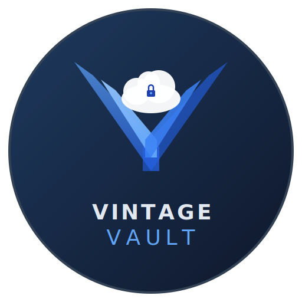

# VintageVault Mission

  

## Why We Exist

**Ransomware is an epidemic.** In 2026, attacks are up 34% year-over-year. Hospitals lose patient records. Schools lose years of student work. Families lose every photo they've ever taken. Small businesses close permanently.

Enterprise IT has solutions — Veeam, Commvault, Spanning. They cost thousands per year and require a team to manage.

**Everyone else has nothing.**

VintageVault exists to change that. Not to build a unicorn. Not to maximize shareholder value. To make sure that when ransomware hits — and it will — regular people have a backup they didn't have to think about.

---

## Our Principles

### 1. Mission First, Revenue Second

We're building VintageVault because the world needs it, not because we need the money. Revenue exists to sustain the mission — to keep the servers running, the code maintained, and the project alive. If we break even, we've succeeded. If we make a profit, we invest it back into the mission.

### 2. Open by Default

The backup engine is open source. Not as a growth hack. Not as a marketing strategy. Because **people deserve to see the code that accesses their most personal files.** Trust isn't something we ask for — it's something we prove, line by line.

### 3. Protect, Don't Profit From Fear

We will never use scare tactics. We will never manufacture urgency. We will educate honestly about real threats, provide real protection, and charge a fair price that sustains the work. If someone is well-served by the free tier forever, that's a win.

### 4. Accessible to Everyone

Backup shouldn't require technical knowledge. It shouldn't require expensive hardware. It shouldn't require an IT department. If a grandparent can't set it up in 5 minutes, we've failed.

### 5. Transparent About Everything

Our code is open. Our costs are knowable. Our motivations are stated plainly in this document. We will publish what we spend, what we earn, and where the money goes. Inspired by Patagonia's radical transparency and Buffer's open financials.

---

## What Success Looks Like

| Metric | Traditional Startup | VintageVault |
|--------|-------------------|-------------|
| **Primary KPI** | Revenue growth | People protected |
| **Goal for free tier** | Convert to paid | Protect as many people as possible |
| **Goal for paid tier** | Maximize ARPU | Sustain the mission |
| **Open source** | Growth hack | Core commitment |
| **Response to competitor** | Defend market share | Celebrate — more people protected |
| **Profit** | Maximize for investors | Reinvest in mission + give back |

**If Google adds native same-provider backup tomorrow, we celebrate.** That means millions of people are protected who weren't before. Then we pivot to cross-provider backup, anomaly detection, or whatever gap remains. The mission is protection, not market dominance.

---

## The Patagonia Parallel

Patagonia said: _"We're in business to save our home planet."_ They make excellent products, charge fair prices, and use profits to fund environmental causes. They famously ran an ad saying **"Don't Buy This Jacket"** — because reducing consumption was more aligned with their mission than maximizing sales.

VintageVault says: **"We're in business to protect everyone's digital life."**

- We make backup so simple that anyone can use it
- We charge only what's needed to sustain the work
- We open-source the engine so anyone can protect themselves for free
- If someone doesn't need our paid product, we'll tell them
- If a competitor does it better, we'll point people there

**We'd rather protect 100,000 people for free than sell 1,000 subscriptions.**

---

## Giving Back

As revenue allows, VintageVault will contribute to the broader mission of digital safety:

1. **1% of revenue** to organizations fighting ransomware and promoting digital literacy (inspired by Patagonia's 1% for the Planet)
2. **Free backup for nonprofits** — schools, community organizations, charities
3. **Open-source contributions** — improvements to rclone, cloud API documentation, security research
4. **Educational content** — free guides on protecting your digital life, aimed at non-technical audiences
5. **Advocacy** — actively encourage Google, Microsoft, and other providers to build native backup features for their users (see below)

---

## If We Succeed, We Disappear

The ultimate success for VintageVault is a world where we're unnecessary.

If Microsoft adds "back up to a second account" as a OneDrive feature, that protects hundreds of millions of people overnight — far more than we could ever reach as a third-party tool. If Google adds the same, billions more. **We should want this to happen.**

VintageVault exists because the major cloud providers haven't solved this problem for their users. We fill the gap. But we also advocate loudly for them to fill it themselves:

- Publish research on the consumer backup gap
- File feature requests with Google and Microsoft
- Make our solution so visible that it embarrasses them into acting
- Celebrate publicly when they do

**If every major provider ships native consumer backup and VintageVault becomes obsolete, our mission is complete.** We shut down, open-source everything, and call it a win. The world is safer. That's the point.

This isn't a theoretical stance — it's a strategic reality. The `/sharedWithMe` API deprecation, OAuth verification costs, and API rate limits all remind us that building on platforms we don't control is inherently fragile. Rather than fight that fragility, we embrace it: **we're a bridge, not a destination.**

---

## A Note on Sustainability

Mission-driven doesn't mean charity. VintageVault must be financially self-sustaining:

- The paid tier exists so the free tier can exist
- Revenue covers infrastructure, maintenance, and the founder's time
- If it doesn't break even, it dies — and then nobody is protected

**The goal is a sustainable organism, not a high-growth startup.** Think public library, not VC portfolio company. It doesn't need to get bigger every quarter. It needs to be there when people need it.

---

_"The best backup is the one you never have to think about — until the day it saves everything."_
