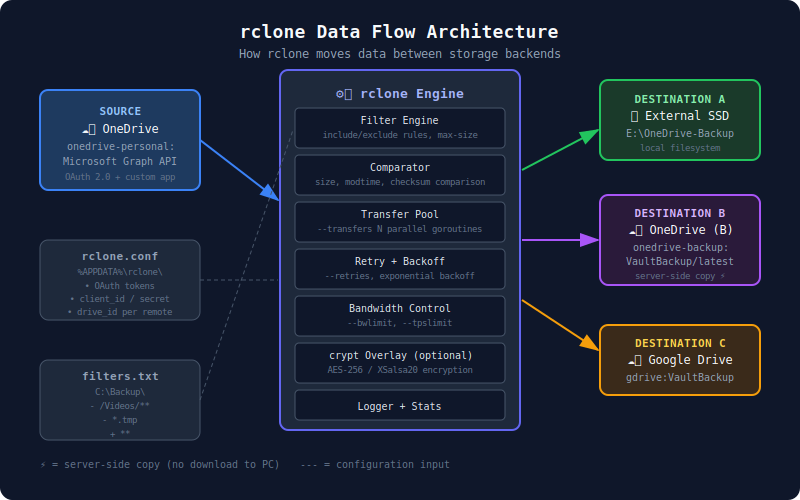

# 00 — rclone Overview & Core Concepts

> **Goal:** Understand what rclone is, how it thinks about data movement, and why its design patterns matter for VintageVault.

---

## What is rclone?

rclone is a command-line program that synchronizes files between local storage and cloud storage providers, or between two cloud storage providers directly. Often described as "rsync for cloud storage," it supports 70+ backends — OneDrive, Google Drive, S3, Dropbox, SFTP, and many more.

It's battle-tested (12+ years old, 42,000+ GitHub stars), written in Go for performance, and extensively used in production by sysadmins, DevOps engineers, and power users.

**Key properties:**
- **Open source** (MIT license) — we can study, fork, and contribute
- **Provider-agnostic** — same commands work across all backends
- **Stateless** — no database, no daemon; relies on file metadata and checksums
- **Composable** — can be combined with cron, scripts, and encryption overlays

---

## Architecture: How rclone Thinks About Storage



rclone models all storage as a **remote** with a **path**. The syntax is always:

```
remote:path/to/folder
```

For local storage, you just use a path (no colon):

```
/mnt/ssd/backup       (Linux/macOS)
D:\Backup             (Windows)
```

```
┌─────────────────────────────────────────────────────────────────┐
│                         rclone                                   │
│                                                                  │
│   ┌──────────────┐    ┌──────────────┐    ┌──────────────┐      │
│   │   Source     │───▶│   Transfer   │───▶│  Destination │      │
│   │  Remote/Path │    │   Engine     │    │  Remote/Path │      │
│   └──────────────┘    └──────────────┘    └──────────────┘      │
│                              │                                   │
│                    ┌─────────┴─────────┐                        │
│                    │  Checksums        │                         │
│                    │  Filters          │                         │
│                    │  Retry logic      │                         │
│                    │  Bandwidth ctrl   │                         │
│                    └───────────────────┘                        │
└─────────────────────────────────────────────────────────────────┘
```

---

## Key Terminology

### Remote
A configured storage backend. Created once with `rclone config`, referenced by name:

```
onedrive-personal:      → your personal OneDrive
onedrive-backup:        → a second OneDrive account for backups
external-ssd:           → an alias for a local drive path
gdrive:                 → Google Drive
```

### Path
The folder within a remote:

```
onedrive-personal:Documents
onedrive-personal:Photos/2024
onedrive-backup:VaultBackup/2024-06-30
```

### Backend
The storage provider implementation inside rclone. Each backend handles the specific API calls for that provider. OneDrive's backend uses the Microsoft Graph API — the same API VintageVault is built on.

### Transfer
A single file being copied from source to destination. rclone does multiple transfers in parallel (default: 4).

### Checker
A goroutine that computes or compares checksums. Runs in parallel (default: 8). Used to decide if a file needs to be copied.

---

## How rclone Decides What to Transfer

This is the heart of rclone's efficiency. For each file, rclone runs a **comparison** between source and destination:

```
┌────────────────────────────────────────────────────────────┐
│             rclone File Comparison Logic                    │
│                                                            │
│  1. Does the file exist at destination?                    │
│     No  → Transfer it                                      │
│     Yes → Continue                                         │
│                                                            │
│  2. Do sizes match?                                        │
│     No  → Transfer it                                      │
│     Yes → Continue                                         │
│                                                            │
│  3. Do modification times match? (if supported)            │
│     No  → Transfer it                                      │
│     Yes → Skip (assume identical)                          │
│                                                            │
│  4. With --checksum flag: Do checksums match?              │
│     No  → Transfer it                                      │
│     Yes → Skip (confirmed identical)                       │
└────────────────────────────────────────────────────────────┘
```

> **VintageVault lesson:** Relying solely on modification times is fast but fragile — times can drift, get reset, or be unreliable across timezones. Checksums are slower but trustworthy. VintageVault's snapshot JSON stores SHA-256 hashes for exactly this reason.

---

## The Four Core Operations

| Command | Behavior | Deletes at destination? |
|---------|----------|------------------------|
| `copy`  | Copy new/changed files | Never |
| `sync`  | Make destination identical to source | Yes (extras removed) |
| `move`  | Copy then delete at source | Source files deleted |
| `check` | Compare without transferring | Never |

> ⚠️ `sync` is powerful but dangerous — it deletes files at the destination that don't exist at the source. For backup purposes, prefer `copy` with versioned destination folders, or `sync --backup-dir` to preserve deleted files.

---

## rclone Configuration File

rclone stores remotes in a config file (usually `~/.config/rclone/rclone.conf` on Windows: `%APPDATA%\rclone\rclone.conf`). Each remote is a named section:

```ini
[onedrive-personal]
type = onedrive
token = {"access_token":"eyJ...","expiry":"2026-12-31T..."}
drive_id = b!abc123...
drive_type = personal
client_id = your-app-client-id
client_secret = your-app-client-secret

[onedrive-backup]
type = onedrive
token = {"access_token":"eyJ...","expiry":"2026-12-31T..."}
drive_id = b!xyz789...
drive_type = personal
client_id = your-app-client-id
client_secret = your-app-client-secret
```

> **Security note:** This file contains OAuth tokens. It's treated like a password file — don't commit it to git, don't share it. rclone will warn you if the permissions are too open.

---

## What rclone Taught VintageVault

Studying rclone's codebase revealed several key design decisions we adopted:

### 1. Server-Side Copy
When copying between two remotes on the same provider (OneDrive → OneDrive), rclone can request the provider to copy the file on their servers — no local download needed. This is called **server-side copy** and it's dramatically faster. VintageVault's cross-account backup must use Graph API's `/copy` endpoint for the same reason.

### 2. Chunked Uploads for Large Files
OneDrive requires chunked upload sessions for files > 4 MB. rclone handles this automatically. VintageVault's `BackupEngine.cs` must implement the same chunking logic.

### 3. Token Refresh
OAuth tokens expire. rclone automatically refreshes tokens before they expire. VintageVault's `GraphClientFactory.cs` uses MSAL which handles this transparently.

### 4. Exponential Backoff
API rate limits (HTTP 429) and transient failures (HTTP 503) are normal at scale. rclone retries with exponential backoff. VintageVault should implement the same.

### 5. Delta Queries
Microsoft Graph supports `delta` queries — instead of listing all files and comparing, you get just the changes since your last sync. This is what makes incremental backups fast. rclone uses this for OneDrive. VintageVault's `SnapshotManager.cs` should too.

---

## Conceptual Map: rclone vs. VintageVault

```
rclone config                    ↔    OAuth setup in VaultConfig.json
rclone copy source: dest:        ↔    BackupEngine.RunBackupAsync()
--filter-from rules.txt          ↔    ExclusionManager.GetExclusions()
rclone check                     ↔    SnapshotManager.VerifySnapshot()
rclone crypt overlay             ↔    Planned: encrypted storage tier
rclone --backup-dir              ↔    Versioned snapshots in /VaultBackup/
rclone --bwlimit                 ↔    Planned: bandwidth control setting
```

---

## Next Steps

Continue to → [01 — Installation & First Config](01-installation-and-first-config.md)
