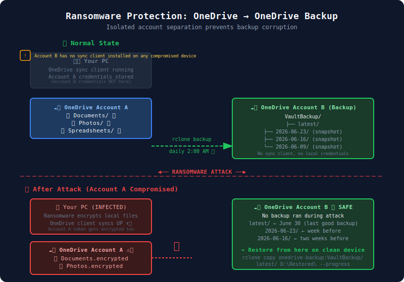

# 04 — Backup OneDrive to Another OneDrive Account

> **Goal:** Copy all your OneDrive files from Account A (your personal account) to Account B (a dedicated backup account) — without downloading anything to your local machine, using server-side copy.

---

## Why OneDrive-to-OneDrive Backup?

This is VintageVault's **core use case**: ransomware-isolated cloud-to-cloud backup. Here's why it matters:



```
┌─────────────────────────────────────────────────────────────────────┐
│                  The Ransomware Problem                             │
│                                                                     │
│  Your Computer                                                      │
│  ├── OneDrive client syncing live                                   │
│  └── 🦠 Ransomware encrypts local files                             │
│       └── OneDrive client syncs encrypted files UP                  │
│            └── ☁️ OneDrive A: NOW ENCRYPTED                         │
│                                                                     │
│  If backup account was authenticated on same device:                │
│  └── Ransomware may also encrypt backup account files               │
└─────────────────────────────────────────────────────────────────────┘

┌─────────────────────────────────────────────────────────────────────┐
│               The VintageVault Solution                             │
│                                                                     │
│  Account A (Personal OneDrive)                                      │
│  └── Your live files (may become compromised)                       │
│                │                                                    │
│                │  rclone server-side copy                           │
│                │  (scheduled, isolated process)                     │
│                ▼                                                    │
│  Account B (Backup-only OneDrive)                                   │
│  └── Read-mostly, no local sync client                              │
│  └── Snapshots with timestamps                                      │
│  └── Accessible from a CLEAN device after attack                   │
└─────────────────────────────────────────────────────────────────────┘
```

**Key isolation principle:** Account B's credentials should NOT be present on the device that runs Account A's OneDrive sync client. The backup process runs as a scheduled, isolated operation.

---

## Prerequisites

- rclone installed (Tutorial 01)
- Custom Azure app registered (Tutorial 02)
- `onedrive-personal` remote configured (source)
- A second Microsoft account for backups
- `onedrive-backup` remote configured (Tutorial 02, Step "Second Account")

---

## Concept: Server-Side Copy

When both remotes are OneDrive, rclone can instruct Microsoft to copy files **within their own infrastructure** — no downloading to your machine:

```
Without server-side copy (slow, wasteful):
OneDrive A → ⬇️ Download to PC → ⬆️ Upload to OneDrive B

With server-side copy (fast, efficient):
OneDrive A → [Microsoft infrastructure] → OneDrive B
             (no local download required)
```

rclone enables this automatically when both source and destination are the same provider type. You can verify it's being used with `--log-level DEBUG` — look for lines containing `server side copy`.

> **Caveat:** Server-side copy only works for files within the same provider. Microsoft's Graph API has a `/copy` endpoint that performs this. However, cross-tenant copies (personal → business or different regions) may fall back to download-then-upload. Check the logs.

---

## Step 1: Verify Both Remotes Work

```powershell
# Test source account
rclone about onedrive-personal:
rclone lsd onedrive-personal:

# Test backup account
rclone about onedrive-backup:
rclone lsd onedrive-backup:
```

Both should respond without errors. Note the available space in Account B — free Microsoft accounts get 5 GB, which may not be enough for large OneDrives. Consider Microsoft 365 Personal ($69.99/year) for 1 TB.

---

## Step 2: Design Your Backup Folder Structure

Don't copy into the root of Account B. Use a clear, versioned structure:

```
onedrive-backup:
└── VaultBackup/
    ├── latest/              ← Current state (updated each run)
    ├── 2026-06-30/          ← Point-in-time snapshot
    ├── 2026-06-23/          ← Previous week
    └── 2026-06-16/          ← Two weeks ago
```

This approach gives you:
- **Fast recovery**: `latest/` always has current files
- **Historical recovery**: named snapshots for point-in-time restore
- **Ransomware protection**: old snapshots remain even if `latest/` is updated with encrypted files

---

## Step 3: Create Your Filter File

Create `C:\Backup\rclone-onedrive-filters.txt` (same as Tutorial 03, or reuse it):

```
# OneDrive source filter file

# Exclude large media folders that don't need cloud-to-cloud backup
- /Videos/**
- /Recordings/**
- /Downloads/**

# Exclude system files
- desktop.ini
- Thumbs.db
- .DS_Store
- *.tmp
- *.temp
- ~$*

# Exclude files larger than 1GB (adjust to your needs)
--max-size 1G

# Include everything else
+ **
```

> **Tip:** For cloud-to-cloud backup, you might want to be more inclusive than for SSD backup (no storage cost per GB beyond account size, and no download bandwidth used). Adjust `--max-size` upward or remove it based on your Account B storage quota.

---

## Step 4: Dry Run the Cross-Account Copy

```powershell
rclone copy onedrive-personal: onedrive-backup:VaultBackup/latest `
    --filter-from C:\Backup\rclone-onedrive-filters.txt `
    --dry-run `
    --progress `
    --log-level INFO `
    --log-file C:\Backup\od-to-od-dry-run.log
```

Review what would transfer:
```powershell
Get-Content C:\Backup\od-to-od-dry-run.log | Where-Object { $_ -match "NOTICE" }
```

---

## Step 5: Run the Initial Full Backup

```powershell
rclone copy onedrive-personal: onedrive-backup:VaultBackup/latest `
    --filter-from C:\Backup\rclone-onedrive-filters.txt `
    --progress `
    --log-file C:\Backup\od-to-od-initial.log `
    --log-level INFO `
    --transfers 4 `
    --checkers 8 `
    --stats 60s
```

> **Note on `--bwlimit`:** For OneDrive-to-OneDrive (server-side), bandwidth limits don't apply the same way since data doesn't flow through your machine. You can omit `--bwlimit`, but keep `--tpslimit 4` to avoid Graph API rate limiting:

```powershell
    --tpslimit 4    # Max 4 API transactions per second
```

---

## Step 6: Create Point-in-Time Snapshots

After each backup, create an immutable snapshot by copying `latest/` to a dated folder. Because this is within the same OneDrive account (B), it uses server-side copy and is very fast:

```powershell
$snapshotDate = Get-Date -Format "yyyy-MM-dd"

rclone copy onedrive-backup:VaultBackup/latest onedrive-backup:VaultBackup/$snapshotDate `
    --log-level INFO `
    --log-file "C:\Backup\snapshot-$snapshotDate.log"
```

This creates:
```
onedrive-backup:VaultBackup/
├── latest/          ← Updated each backup run
└── 2026-06-30/      ← New immutable snapshot
```

---

## Step 7: Full Backup + Snapshot Script

Save as `C:\Backup\run-cloud-backup.ps1`:

```powershell
<#
.SYNOPSIS
    rclone OneDrive A → OneDrive B cloud backup with snapshots
.DESCRIPTION
    Copies personal OneDrive to backup OneDrive with:
    - Smart filtering
    - Point-in-time snapshots
    - Log management
    - Basic error handling
#>

param(
    [string]$SourceRemote = "onedrive-personal",
    [string]$BackupRemote = "onedrive-backup",
    [string]$BackupRoot = "VaultBackup",
    [string]$FilterFile = "C:\Backup\rclone-onedrive-filters.txt",
    [string]$LogDir = "C:\Backup\logs",
    [int]$KeepSnapshots = 12,        # Keep 12 weekly snapshots
    [switch]$SkipSnapshot             # Use -SkipSnapshot to skip snapshot creation
)

$timestamp = Get-Date -Format "yyyy-MM-dd"
$logFile = "$LogDir\cloud-backup-$timestamp.log"
$latestPath = "${BackupRemote}:${BackupRoot}/latest"

New-Item -ItemType Directory -Path $LogDir -Force | Out-Null

function Write-Status($msg) {
    $line = "$(Get-Date -Format 'HH:mm:ss') | $msg"
    Write-Host $line
    Add-Content -Path $logFile -Value $line
}

Write-Status "=== VaultBackup Start: $timestamp ==="
Write-Status "Source: ${SourceRemote}:"
Write-Status "Destination: $latestPath"

# ── Phase 1: Sync source to latest/ ───────────────────────────────
Write-Status "Phase 1: Copying ${SourceRemote}: → $latestPath"

& rclone copy "${SourceRemote}:" $latestPath `
    --filter-from $FilterFile `
    --log-file $logFile `
    --log-level INFO `
    --transfers 4 `
    --checkers 8 `
    --tpslimit 4 `
    --stats 60s `
    --stats-log-level NOTICE

$phase1Exit = $LASTEXITCODE

if ($phase1Exit -ne 0) {
    Write-Status "❌ Phase 1 failed (exit $phase1Exit). Check $logFile"
    exit $phase1Exit
}

Write-Status "✅ Phase 1 complete"

# ── Phase 2: Create snapshot ───────────────────────────────────────
if (-not $SkipSnapshot) {
    $snapshotPath = "${BackupRemote}:${BackupRoot}/$timestamp"
    Write-Status "Phase 2: Creating snapshot → $snapshotPath"

    & rclone copy $latestPath $snapshotPath `
        --log-file $logFile `
        --log-level INFO `
        --transfers 8

    $phase2Exit = $LASTEXITCODE

    if ($phase2Exit -ne 0) {
        Write-Status "⚠️  Snapshot creation failed (exit $phase2Exit) — backup data is safe"
    } else {
        Write-Status "✅ Snapshot created: $snapshotPath"
    }
}

# ── Phase 3: Prune old snapshots ──────────────────────────────────
Write-Status "Phase 3: Checking snapshot count (keep latest $KeepSnapshots)"

$allSnapshots = & rclone lsd "${BackupRemote}:${BackupRoot}" |
    Where-Object { $_ -match "\d{4}-\d{2}-\d{2}" } |
    ForEach-Object { ($_ -split "\s+")[-1] } |
    Sort-Object

if ($allSnapshots.Count -gt $KeepSnapshots) {
    $toDelete = $allSnapshots | Select-Object -First ($allSnapshots.Count - $KeepSnapshots)
    foreach ($snapshot in $toDelete) {
        Write-Status "Pruning old snapshot: $snapshot"
        & rclone purge "${BackupRemote}:${BackupRoot}/$snapshot" --log-file $logFile
    }
}

Write-Status "=== VaultBackup Complete: $(Get-Date -Format 'HH:mm:ss') ==="
```

---

## Step 8: Verify the Cross-Account Backup

### 8.1 Verify file counts

```powershell
# Count files in source (with filters)
$sourceCount = (& rclone ls "onedrive-personal:" --filter-from C:\Backup\rclone-onedrive-filters.txt).Count
Write-Host "Source files: $sourceCount"

# Count files in backup
$backupCount = (& rclone ls "onedrive-backup:VaultBackup/latest").Count
Write-Host "Backup files: $backupCount"
```

### 8.2 Deep checksum check

```powershell
rclone check onedrive-personal: onedrive-backup:VaultBackup/latest `
    --filter-from C:\Backup\rclone-onedrive-filters.txt `
    --log-level INFO `
    --log-file C:\Backup\od-to-od-check.log `
    --progress
```

Look for lines with `ERROR`:
```powershell
Get-Content C:\Backup\od-to-od-check.log | Select-String "ERROR"
```

No output = ✅ everything matches.

### 8.3 Browse backup account in browser

Sign in to [onedrive.live.com](https://onedrive.live.com) with Account B's credentials (on a different browser or in a private window). You should see:

```
Files
└── VaultBackup/
    ├── latest/
    │   ├── Documents/
    │   ├── Photos/
    │   └── ...
    └── 2026-06-30/
        └── (same structure)
```

### 8.4 Test restoration

Restore a specific file to verify it's readable:

```powershell
# Download a specific file from backup account to local for verification
rclone copy "onedrive-backup:VaultBackup/latest/Documents/Resume.docx" C:\temp\restore-test\

# Open it
Start-Process "C:\temp\restore-test\Resume.docx"
```

---

## Step 9: Ransomware Recovery Simulation

To understand what recovery looks like, walk through this mental model:

```
Scenario: Ransomware encrypted your OneDrive on June 30, 2026

Recovery steps:
1. Don't run another backup (would overwrite good data with encrypted data)
2. Sign in to Account B from a CLEAN device
3. Navigate to VaultBackup/2026-06-23/ (last good snapshot before attack)
4. Download files you need, or use rclone to restore:

   rclone copy onedrive-backup:VaultBackup/2026-06-23/ D:\Restored\ --progress

5. Verify restored files are readable (not encrypted)
6. Contact Microsoft to restore OneDrive Account A to a clean state
   (OneDrive has 30-day version history built-in)
7. Once Account A is clean, re-run backup to sync Account B
```

---

## Advanced: Differential Snapshots

Instead of full copies per snapshot, use `--backup-dir` to save only files that changed:

```powershell
# On subsequent runs, files that would be overwritten in latest/ 
# are moved to the dated snapshot instead
rclone sync onedrive-personal: onedrive-backup:VaultBackup/latest `
    --backup-dir "onedrive-backup:VaultBackup/$(Get-Date -Format 'yyyy-MM-dd')" `
    --filter-from C:\Backup\rclone-onedrive-filters.txt `
    --log-level INFO
```

This means:
- `latest/` is always a perfect mirror of source
- Dated folders only contain files that **changed or were deleted** since last run
- Dramatically less storage used for snapshots

> ⚠️ **Caution:** This uses `sync` (not `copy`), which deletes files in `latest/` that no longer exist in source. This is intentional for mirroring, but ensure your dated snapshots retain deleted files via `--backup-dir`.

---

## Common Issues

### Server-side copy not working (falling back to download/upload)
Check the logs for `server side copy`:
```
rclone copy ... --log-level DEBUG 2>&1 | Select-String "server side"
```
If not found, it fell back. This can happen across different Microsoft tenants. Performance will be slower but correctness is the same.

### "Quota exceeded" on Account B
Account B is full. Either upgrade to Microsoft 365 (1 TB) or prune old snapshots:
```powershell
rclone about onedrive-backup:
rclone purge onedrive-backup:VaultBackup/2026-01-01  # Delete old snapshot
```

### Files show different sizes source vs. backup
Some file types (Office documents) may be stored differently in OneDrive. Use `--ignore-size` combined with `--checksum` to compare correctly:
```powershell
rclone check onedrive-personal: onedrive-backup:VaultBackup/latest `
    --filter-from C:\Backup\rclone-onedrive-filters.txt `
    --download  # Force checksum comparison by downloading
```

---

## Next Steps

Continue to → [05 — Filtering & Exclusions](05-filtering-and-exclusions.md)
