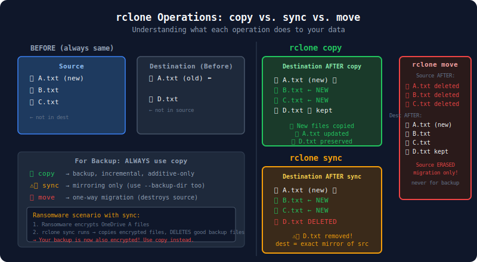

# 06 — Sync vs. Copy vs. Move Operations

> **Goal:** Understand the critical difference between rclone's core data-movement commands and when each is appropriate for backup scenarios.

---

## The Three Operations at a Glance



```
┌─────────────────────────────────────────────────────────────────┐
│                     rclone Operations                           │
│                                                                 │
│  SOURCE             COMMAND        DESTINATION                  │
│  ─────────          ───────        ─────────────                │
│                                                                 │
│  file.txt ──────── copy ────────▶  file.txt  (unchanged)        │
│  file.txt ──────── sync ────────▶  file.txt  (destination       │
│  extra.txt  (only                  (extra.txt  becomes          │
│   at dest)   at dest)               deleted)  identical)        │
│  file.txt ──────── move ────────▶  file.txt  (source           │
│                                    (deleted)   deleted)         │
└─────────────────────────────────────────────────────────────────┘
```

| Operation | New files | Changed files | Source-only files at dest | Source deleted after? |
|-----------|-----------|---------------|--------------------------|----------------------|
| `copy` | ✅ Copied | ✅ Overwritten | ❌ Left alone | No |
| `sync` | ✅ Copied | ✅ Overwritten | ✅ **Deleted** | No |
| `move` | ✅ Copied | ✅ Overwritten | ❌ Left alone | **Yes** |

---

## `rclone copy` — The Safe Backup Operation

```powershell
rclone copy source:path dest:path [flags]
```

**What it does:**
- Copies files from source to destination
- Overwrites destination files if the source version is newer or different
- **Never deletes anything at the destination**
- Files at destination that don't exist at source are untouched

**When to use `copy`:**
- ✅ Backup (primary use case)
- ✅ When destination may have files from previous, older backups
- ✅ When you want additive-only behavior (safe for ransomware protection)
- ✅ When destination is shared or may have independent contents

```
Before copy:
Source:      A.txt  B.txt  C.txt
Destination: A.txt (old)  D.txt (not in source)

After copy:
Source:      A.txt  B.txt  C.txt
Destination: A.txt (new)  B.txt  C.txt  D.txt  ← D.txt kept!
```

---

## `rclone sync` — The Mirror Operation

```powershell
rclone sync source:path dest:path [flags]
```

**What it does:**
- Makes destination an exact mirror of source
- Copies new and changed files
- **Deletes files at destination that don't exist at source**
- After sync, destination = source (filtered)

**When to use `sync`:**
- ✅ Mirroring (keeping two locations identical)
- ✅ Website deployment
- ✅ With `--backup-dir` to preserve deleted files (see below)
- ❌ **Not for backup without `--backup-dir`** — ransomware attack would wipe your backup

```
Before sync:
Source:      A.txt  B.txt  C.txt
Destination: A.txt (old)  D.txt (not in source)

After sync:
Source:      A.txt  B.txt  C.txt
Destination: A.txt (new)  B.txt  C.txt
             ──────────────────────────
             D.txt is DELETED ⚠️
```

### Making `sync` safe with `--backup-dir`

```powershell
rclone sync source:path dest:path/current `
    --backup-dir dest:path/deleted/2026-06-30
```

Files deleted from source (and thus from `current/`) are moved to `deleted/2026-06-30/` instead of being permanently deleted. This is how rclone implements versioned backup with sync semantics.

---

## `rclone move` — One-Way Migration

```powershell
rclone move source:path dest:path [flags]
```

**What it does:**
- Copies all files from source to destination
- After successful copy, **deletes the source file**
- If copy fails, source is not deleted

**When to use `move`:**
- ✅ Migrating data between providers permanently
- ✅ Archiving old files to cold storage (then removing from hot storage)
- ❌ **Never for backup** — destroys source data

```
Before move:
Source:      A.txt  B.txt  C.txt
Destination: (empty)

After move:
Source:      (empty — all files deleted)
Destination: A.txt  B.txt  C.txt
```

---

## `rclone check` — Verification Only

```powershell
rclone check source:path dest:path [flags]
```

**What it does:**
- Compares checksums between source and destination
- Reports mismatches, missing files, extra files
- **Never transfers anything**
- Safe to run at any time

This is covered in detail in Tutorial 07.

---

## Advanced: `rclone bisync` — Bidirectional Sync

```powershell
rclone bisync source:path dest:path [flags]
```

**What it does:**
- Syncs changes in BOTH directions
- New files on either side are copied to the other
- Detects and reports conflicts (same file changed on both sides)
- Maintains a journal of last known state

**When to use `bisync`:**
- ✅ Keeping two work locations in sync (e.g., two computers)
- ✅ Collaborative scenarios where both sides can change
- ❌ Not ideal for backup — you want one-way flow

> **VintageVault note:** bisync is not appropriate for VintageVault. Backup should always be one-directional — source changes should go to destination, never the reverse. A backup account shouldn't be able to "infect" the source.

---

## Decision Guide: Which Operation to Use?

```
                    START
                      │
          ┌───────────▼───────────┐
          │ Do you want to delete │
          │ files at destination  │
          │ that no longer exist  │
          │ at source?            │
          └───────────────────────┘
                  │       │
                 YES      NO
                  │       │
    ┌─────────────▼─┐   ┌─▼──────────────────┐
    │   Use SYNC    │   │ Do you want source  │
    │  (consider    │   │ files deleted after │
    │  --backup-dir │   │ copy?               │
    │  for safety)  │   └────────────────────┘
    └───────────────┘          │        │
                              YES       NO
                               │        │
                     ┌─────────▼─┐  ┌───▼────────┐
                     │ Use MOVE  │  │  Use COPY  │
                     │(migration │  │  (backup)  │
                     │ only)     │  └────────────┘
                     └───────────┘
```

**For VintageVault backups:** Always `copy` (additive-only, never deletes backup data).

---

## Flags That Modify Behavior

### `--immutable`
Refuse to update or delete existing files at destination. Useful for write-once backup targets:

```powershell
rclone copy source: dest: --immutable
```

If a file at destination would be overwritten, rclone raises an error instead. Great for audit trails.

### `--no-update-modtime`
Don't update modification times at destination after copy. Useful when you want to preserve the destination's timestamps:

```powershell
rclone copy source: dest: --no-update-modtime
```

### `--update` (or `-u`)
Skip files at destination that are **newer** than at source:

```powershell
rclone copy source: dest: --update
```

Useful when files at destination may have been modified independently and you don't want to overwrite newer versions.

### `--size-only`
Compare by size only (skip checksum and modtime comparison). Faster but less safe:

```powershell
rclone copy source: dest: --size-only
```

### `--checksum`
Compare by checksum only (ignore size and modtime). Slowest but most accurate:

```powershell
rclone copy source: dest: --checksum
```

---

## Understanding "Transferred" vs. "Checks"

In rclone's progress output:

```
Transferred:   1.2 GiB / 5.0 GiB, 24%, 10.0 MiB/s, ETA 6m20s
Checks:             400 / 4823, 8%
Transferred:          23 / 4823, 0%
```

- **Checks** = files examined to decide if they need transferring (fast)
- **Transferred** (data) = bytes actually moved (slow)
- **Transferred** (count) = files fully copied

If `Checks` is large but `Transferred` (count) is small, rclone is doing efficient incremental backup — most files haven't changed so they're just checked and skipped.

---

## Practical Scenarios Compared

### Scenario 1: Initial backup (all files new)

```powershell
# All files copied (nothing at destination yet)
rclone copy onedrive-personal: E:\Backup --progress
# Checks: 4823, Transferred: 4823 files
```

### Scenario 2: Daily incremental (few files changed)

```powershell
# Only changed files copied
rclone copy onedrive-personal: E:\Backup --progress
# Checks: 4823, Transferred: 7 files (only what changed)
```

### Scenario 3: Weekly mirror (ensure exact match)

```powershell
# Sync would delete extras, so use with backup-dir
rclone sync onedrive-personal: E:\Backup/latest `
    --backup-dir "E:\Backup/$(Get-Date -Format 'yyyy-MM-dd')" `
    --progress
```

### Scenario 4: Archive old files (free up source space)

```powershell
# Move files older than 2 years to cold storage
rclone move onedrive-personal:Documents/Archive cold-storage:Archive `
    --max-age 730d `
    --progress
```

---

## `rclone sync` Safety Checklist

Before running `rclone sync` (especially without `--backup-dir`):

- [ ] I have run `--dry-run` first and reviewed the output
- [ ] I understand that files only at destination will be **permanently deleted**
- [ ] I have a separate backup (not `sync`-managed) of the destination
- [ ] I have confirmed the source remote is correct (not accidentally reversed)
- [ ] I have confirmed the destination path is correct

> A common disaster: running `rclone sync A: B:` when you meant `rclone sync B: A:` — source and destination are reversed, wiping your source from the destination.

---

## Next Steps

Continue to → [07 — Verification & Checksums](07-verification-and-checksums.md)
