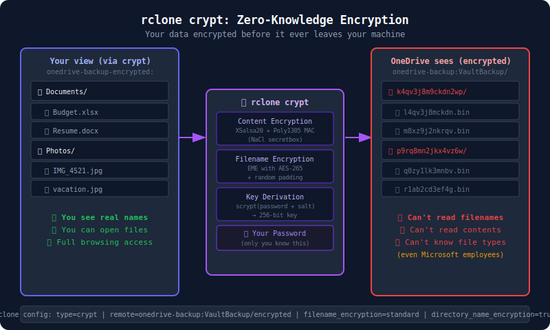

# 08 — Encryption with rclone crypt

> **Goal:** Set up zero-knowledge encrypted backup using rclone's built-in `crypt` overlay — your backup destination can't read your files even if they gain access.

---

## What Is rclone crypt?

`rclone crypt` is a **virtual overlay** that sits between rclone and any storage backend. It transparently encrypts files before they're written and decrypts them when read. The storage backend (OneDrive, Google Drive, S3, etc.) only ever sees encrypted ciphertext.



```
┌──────────────────────────────────────────────────────────────────┐
│                    rclone crypt architecture                     │
│                                                                  │
│  Your files                                                      │
│  (plaintext)                                                     │
│       │                                                          │
│       ▼                                                          │
│  ┌──────────┐    AES-256-CTR + Poly1305-AES                      │
│  │  crypt   │ ◄── encryption ──────────────────────────────────  │
│  │  remote  │                                                    │
│  └──────────┘                                                    │
│       │                                                          │
│       ▼                                                          │
│  ┌──────────────────────────────┐                                │
│  │  Actual storage backend      │                                │
│  │  (OneDrive, Google Drive,    │                                │
│  │   S3, local disk, etc.)      │                                │
│  │                              │                                │
│  │  Files appear as:            │                                │
│  │  abcd1234efgh5678.bin        │                                │
│  │  xyz789abcdef0123.bin        │                                │
│  └──────────────────────────────┘                                │
└──────────────────────────────────────────────────────────────────┘
```

**What gets encrypted:**
- File **contents** (AES-256-CTR encryption)
- File **names** (obfuscated, unreadable without your password)
- **Directory names** (also obfuscated)

**What the storage provider sees:**
- A folder of randomly-named binary files
- No way to know what data is inside, or even the filenames
- Can't list the files meaningfully without your rclone crypt password

---

## Why Encrypt Your Backup?

| Threat | Without Encryption | With rclone crypt |
|--------|--------------------|-------------------|
| Backup account compromised | Attacker can read all your files | Sees only encrypted gibberish |
| Microsoft employee access | Technically possible | Impossible without your key |
| Legal request to Microsoft | Microsoft can comply | Microsoft has nothing readable |
| Backup account shared accidentally | Exposes all data | Safe — no key, no data |

For VintageVault, encryption is particularly valuable for users who:
- Store sensitive financial or medical documents
- Back up to a shared or work account
- Want true privacy from the storage provider

---

## How rclone crypt Encryption Works

### Encryption algorithm

rclone uses **NaCl secretbox** (from the Go standard library):
- **Content**: XSalsa20 stream cipher + Poly1305 MAC (authenticated encryption)
- **Alternative**: AES-256-CTR + HMAC-SHA256 (also available)

### Password to key derivation

Your password is stretched into a 256-bit encryption key using **scrypt** — deliberately slow to prevent brute-force attacks. The same password always produces the same key.

### File naming

Files are encrypted using your password + a separate "salt" that obscures filenames and prevents filename enumeration:

```
Documents/Budget.xlsx
    ↓ (crypt with password + salt)
l4qv3j8mckdn2wp5y6z0xb9r.bin  (actual stored name)
```

### Random salt per-file

Each file gets a unique random nonce, so two identical files produce different ciphertext — preventing correlation attacks.

---

## Setting Up rclone crypt

### Step 1: Have a base remote configured

You need an existing remote where encrypted files will be stored. For example, the `onedrive-backup` remote from Tutorial 02.

### Step 2: Create a crypt remote on top of it

```powershell
rclone config
```

```
n) New remote
name> onedrive-backup-encrypted

Storage> crypt

Remote to encrypt/decrypt.
remote> onedrive-backup:VaultBackup/encrypted
```

> The path `onedrive-backup:VaultBackup/encrypted` means: inside the `onedrive-backup` remote, in the `VaultBackup/encrypted` folder. All encrypted files go here.

```
How to encrypt the filenames.
   standard  → encrypt filenames normally (recommended)
   obfuscate → lightweight scramble (not encryption)
   off        → don't encrypt filenames (reveals structure)
Filename encryption> standard
```

Choose `standard` for full filename encryption.

```
Option to either encrypt directory names or leave them intact.
   true  → encrypt directory names
   false → leave directory names as-is
Directory name encryption> true
```

Choose `true` (encrypt directory names too — maximum privacy).

```
Password or pass phrase for encryption.
y) Yes, type in my own password
g) Generate random password
y/g> y

Enter the password:
password:
Confirm the password:
password:
```

Enter a **strong, unique password** that you store securely (password manager, printed and in a safe). If you lose this password, your backup is unrecoverable.

```
Password or pass phrase for salt.
Optional but recommended.
y) Yes, type in my own password
g) Generate random password
n) No, leave this optional blank password
y/g/n> g
```

Let rclone generate a random salt. Copy this for your records — you need both password AND salt to decrypt.

After setup, your config gains a new section:

```ini
[onedrive-backup-encrypted]
type = crypt
remote = onedrive-backup:VaultBackup/encrypted
filename_encryption = standard
directory_name_encryption = true
password = *** ENCRYPTED ***
password2 = *** ENCRYPTED ***
```

The passwords are stored encrypted in the config file itself (using the config file password if set).

---

## Step 3: Back Up Through the crypt Remote

Now use the crypt remote as your backup destination:

```powershell
rclone copy onedrive-personal: onedrive-backup-encrypted: `
    --filter-from C:\Backup\rclone-onedrive-filters.txt `
    --progress `
    --log-file C:\Backup\encrypted-backup.log
```

**What happens:**
1. rclone reads files from `onedrive-personal:`
2. The crypt layer encrypts each file with your password
3. Encrypted files are written to `onedrive-backup:VaultBackup/encrypted/`

The actual files in OneDrive B look like:
```
VaultBackup/encrypted/
├── k4qv3j8m9ckdn2wp/          ← encrypted "Documents"
│   ├── l4qv3j8mckdn.bin       ← encrypted "Budget.xlsx"
│   └── m8xz9j2nkrqv.bin       ← encrypted "Resume.docx"
└── p9rq8mn2jkx4vz6w/          ← encrypted "Photos"
    └── q0zy1lk3mnbv.bin        ← encrypted "IMG_4521.jpg"
```

---

## Step 4: Verify Encryption is Working

### Check the raw backend (should see gibberish)

```powershell
# Direct view (bypassing crypt) — should see encrypted filenames
rclone lsd onedrive-backup:VaultBackup/encrypted
```

Output:
```
          -1 2026-06-30 12:00:00        -1 k4qv3j8m9ckdn2wp
          -1 2026-06-30 12:00:00        -1 p9rq8mn2jkx4vz6w
```

Unintelligible folder names ✅

### Check through crypt (should see real names)

```powershell
# Through crypt overlay — should see real filenames
rclone lsd onedrive-backup-encrypted:
```

Output:
```
          -1 2026-06-30 12:00:00        -1 Documents
          -1 2026-06-30 12:00:00        -1 Photos
```

Real folder names ✅

### Try to open an encrypted file directly

Download one of the raw `.bin` files and try to open it:

```powershell
rclone copy "onedrive-backup:VaultBackup/encrypted/k4qv3j8m9ckdn2wp/l4qv3j8mckdn.bin" C:\temp\test\

# Try to open — should fail, it's encrypted
notepad C:\temp\test\l4qv3j8mckdn.bin
```

The file should appear as random binary data — unreadable without the crypt key. ✅

---

## Step 5: Restoring Encrypted Files

Restoration is transparent through the crypt remote:

```powershell
# Restore all files to local folder
rclone copy onedrive-backup-encrypted: C:\Restored --progress

# Restore a specific file
rclone copy "onedrive-backup-encrypted:Documents/Budget.xlsx" C:\Restored\

# Restore to original OneDrive (recovery scenario)
rclone copy onedrive-backup-encrypted:Documents onedrive-personal:Documents-Restored
```

---

## Storing Your crypt Password Safely

**The password is the key to your backup.** Lose it → lose your backup data.

### Recommended storage

```
✅ Password manager (1Password, Bitwarden, LastPass)
   → Store: crypt password + salt
   → Note: "rclone crypt for VaultBackup, as of 2026-06-30"

✅ Physical backup
   → Print the password and salt
   → Store in a fireproof safe or with a trusted person

✅ Secret sharing
   → Split the password using Shamir's Secret Sharing
   → Distribute 2-of-3 shares to trusted contacts

❌ Cloud document (Google Docs, OneDrive, email)
   → If the account is compromised, the key is also compromised
   → Defeats the purpose of encryption
```

---

## Advanced: Mounting the Encrypted Remote

rclone can mount the encrypted remote as a local drive letter — you can then browse and open encrypted files with Windows Explorer:

```powershell
# Mount encrypted backup as Z: drive (requires WinFsp installed)
# Install: https://winfsp.dev/
rclone mount onedrive-backup-encrypted: Z: --vfs-cache-mode full

# Now browse Z:\ in Windows Explorer — you see real filenames!
explorer Z:\
```

> **WinFsp** (Windows File System Proxy) is required for `rclone mount` on Windows. It's free and open source.

This is useful for browsing and restoring individual files without downloading everything.

---

## Encryption vs. OneDrive's Built-in Features

| Feature | Microsoft encryption | rclone crypt |
|---------|---------------------|--------------|
| **At-rest encryption** | ✅ AES-256 | ✅ XSalsa20/AES-256 |
| **Who holds the key** | Microsoft | You |
| **Microsoft can read files** | ✅ Yes | ❌ No (zero-knowledge) |
| **Law enforcement access** | Via Microsoft | Impossible |
| **Filename encryption** | ❌ No | ✅ Yes |
| **Directory encryption** | ❌ No | ✅ Yes |
| **Your recovery if password lost** | Microsoft can help | Unrecoverable |

rclone crypt is **zero-knowledge** — even Microsoft (or whoever runs the backup account) cannot read your data.

---

## VintageVault Encryption Roadmap

Based on this research, VintageVault's planned encrypted tier would:

1. Generate a random encryption key per user account (not a user-chosen password)
2. Store the key encrypted in Azure Key Vault or local secure storage
3. Use the same XSalsa20 / AES-256 algorithm rclone uses
4. Provide an "encryption key export" feature for user custody of their key
5. Show users clearly: "Your backup is encrypted. Even we can't read it."

The hard UX challenge: making key recovery possible (unlike pure rclone crypt) without giving ourselves access to the key. One approach: key escrow with user-held recovery phrase.

---

## Next Steps

Continue to → [09 — Automation on Windows](09-automation-windows-task-scheduler.md)
